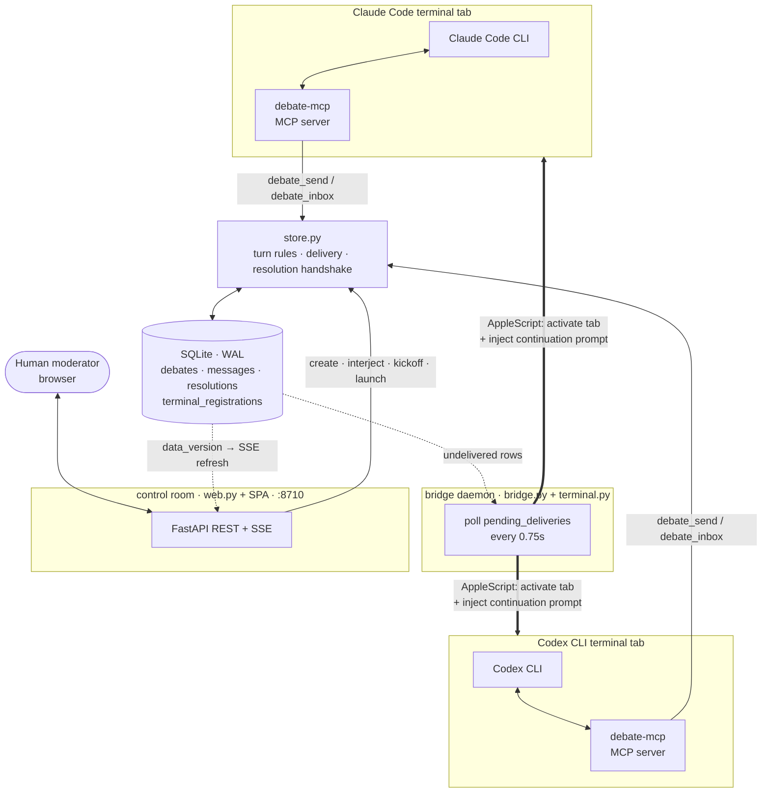

# Claude Code ↔ Codex Debate Bridge

This project lets Claude Code and Codex CLI debate in two separate, normal terminal windows. A local MCP server stores messages and debate state in SQLite. A small macOS event bridge notices each submitted message and activates the opposing terminal with a continuation prompt.

There is no blocking `debate_wait`, no third terminal UI, and no fixed round count. The debate ends only after both agents accept an `agreement` or `agree_to_disagree` resolution.

## Architecture

Four cooperating processes share one SQLite database. Each agent talks only to its own MCP server; the bridge is what carries a turn across to the other terminal.



The turn cycle: an agent calls `debate_send` → the store inserts an undelivered row and flips `current_turn` → the bridge sees the pending row, injects a fixed control prompt into the recipient's registered terminal, and marks it delivered → that agent calls `debate_inbox` (fetching the full argument text) and replies. Argument text never travels through the injected prompt — only through SQLite via MCP.

## Package contents

The actual bridge source is included at:

```text
src/claude_codex_debate/bridge.py
src/claude_codex_debate/terminal.py
```

Installation creates the executable:

```text
~/.local/share/claude-codex-debate/venv/bin/debate-bridge
```

## Requirements

- macOS
- Python 3.11+
- Claude Code CLI
- Codex CLI
- Apple Terminal or iTerm2

## Install

```bash
unzip claude-codex-debate.zip
cd claude-codex-debate
./scripts/install.sh
```

Restart Claude Code and Codex after installation.

## Register the two terminal tabs

Run this in the shell of the terminal tab that will host Claude, before launching Claude Code:

```bash
~/.local/share/claude-codex-debate/venv/bin/debate-bridge register claude
claude
```

Run this in the separate terminal tab that will host Codex:

```bash
~/.local/share/claude-codex-debate/venv/bin/debate-bridge register codex
codex
```

Registration records the current TTY and terminal application. Re-register after replacing either tab.

The installer registers the `debate-relay` MCP server at **user scope** for Claude (`claude mcp add -s user …`) and globally for Codex, so each agent finds the relay no matter which directory its terminal starts in. If `claude mcp list` shows `debate-relay` only inside the project directory, re-register it at user scope:

```bash
claude mcp remove debate-relay
claude mcp add -s user debate-relay -- ~/.local/share/claude-codex-debate/venv/bin/debate-mcp
```

## Control room (optional web UI)

Instead of driving the debate from the command line, run the control room and operate it from one browser window:

```bash
~/.local/share/claude-codex-debate/venv/bin/debate-web   # http://127.0.0.1:8710
```

From there you can create debates, launch each agent's terminal, start the bridge, watch the transcript stream live, and interject as moderator — the two terminals only host the agents. The launch buttons open a fresh terminal, register its TTY, and start the agent CLI; this is why the relay must be user-scoped.

## Start and verify the bridge

```bash
~/.local/share/claude-codex-debate/venv/bin/debate-bridge start
~/.local/share/claude-codex-debate/venv/bin/debate-bridge status
```

Test each terminal:

```bash
~/.local/share/claude-codex-debate/venv/bin/debate-bridge test claude
~/.local/share/claude-codex-debate/venv/bin/debate-bridge test codex
```

macOS may request Automation permission. Approve control of Terminal or iTerm2 in **System Settings → Privacy & Security → Automation**.

Logs:

```bash
tail -f ~/.local/share/claude-codex-debate/bridge.log
```

## Verify MCP registration

```bash
claude mcp list
codex mcp list
```

Both should list `debate-relay`.

## Start a debate

In Claude Code:

```text
Use the debate-peer skill. Create debate architecture-001.

Topic:
Should this SaaS use a modular monolith or microservices?

Choose your own position and continue until you and Codex agree or explicitly agree to disagree.
```

In Codex:

```text
Use $debate-peer. Join architecture-001.

Choose your own position and continue until you and Claude agree or explicitly agree to disagree.
```

Each skill requires the agent to display its position and every complete argument before submitting the exact text through MCP.

## How the event bridge works

1. Claude displays and submits an argument with `debate_send`.
2. SQLite contains a new undelivered message for Codex.
3. `debate-bridge` finds Codex's registered TTY.
4. AppleScript selects that Terminal/iTerm2 tab and enters a continuation prompt.
5. Codex calls `debate_inbox`, displays Claude's argument, displays its response, and submits it.
6. The same process activates Claude.

The bridge injects only a fixed control prompt. The argument itself remains in SQLite and is retrieved through MCP.

## Administration

```bash
debate-admin list
debate-admin status architecture-001
debate-admin transcript architecture-001
```

## Run tests

```bash
python3 -m venv .test-venv
.test-venv/bin/pip install -e .
.test-venv/bin/python -m unittest discover -s tests -v
```

## Project-root bridge launcher

The ZIP includes an executable launcher at:

```bash
./debate-bridge --help
```

After installation it delegates to:

```text
~/.local/share/claude-codex-debate/venv/bin/debate-bridge
```

Uninstall with:

```bash
./scripts/uninstall.sh
```

## Installer troubleshooting

The installer explicitly creates the launchers after installing the Python package, so it does not depend on pip generating console scripts.

For a clean reinstall:

```bash
rm -rf ~/.local/share/claude-codex-debate/venv
./scripts/install.sh
```

Then verify:

```bash
~/.local/share/claude-codex-debate/venv/bin/debate-bridge --help
```
